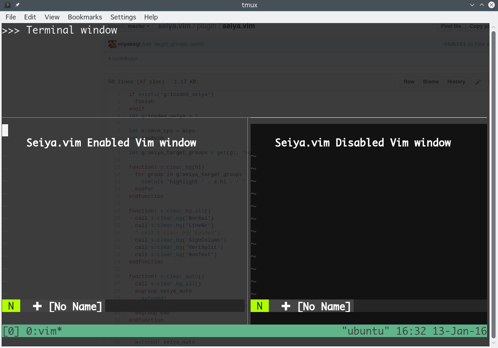

Yet Another Seiya.nvim
=========

NeoVim plugin to clear and make transparent background color in (transparent) terminal.

original one is developed by @miyakokgi https://github.com/miyakogi/seiya.vim

## Screen shot



## Usage

### Installation

for [lazy.nvim](https://github.com/folke/lazy.nvim)
```lua
{
  "orumin/ya-seiya.nvim",
  name = "seiya",
  opts = {}
}
```

### Configuration

```lua
require("seiya").setup({
    -- automatically enable when neovim starts
    auto_enabled = false,
    -- change highlight groups to clear
    target_groups = {"guibg", "ctermbg"}
})
```

### Commands

#### Enable

`:SeiyaEnable`

#### Disable

`:SeiyaDisable`

If backgroung color is not updated, try `colorshame [your_colorscheme]`


